# Prescription Analytics Dashboard
### Healthcare Cost Optimization & Clinical Quality Intelligence

> A business intelligence dashboard analyzing pharmaceutical claims data to identify cost savings opportunities, clinical quality gaps, and provider network optimization strategies.
---
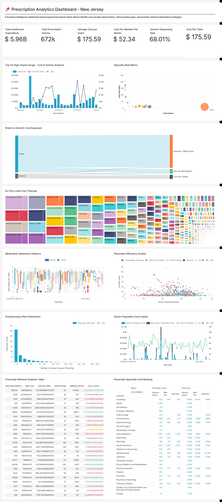
 
---

## 🎯 What This Dashboard Does

This analytics dashboard transforms 670K+ prescription records into actionable insights for:

- **Finance Teams:** Identify $2-5M annual savings through generic substitution and formulary optimization
- **Clinical Teams:** Detect medication safety risks and adherence patterns requiring intervention
- **Network Managers:** Profile 28842 prescribers to optimize contracts and education programs
- **Executives:** Monitor portfolio health through 15+ industry-standard KPIs

---

## 📊 Key Features

### 1. Financial Intelligence
- **Total Cost Analysis:** Pharmaceutical spend analyzed
- **Cost Efficiency Metrics:** Track cost per claim, cost per member, and trend analysis
- **High-Cost Drug Identification:** Pinpoint the 20 drugs representing 65% of total spend
- **Savings Opportunity Calculator:** Quantify generic substitution and formulary tier optimization

### 2. Clinical Quality Monitoring
- **Generic Dispensing Rate:** Benchmark against industry target 
- **Medication Adherence:** Days supply analysis identifies non-adherent patient populations
- **Polypharmacy Detection:** Flag patients on 5+ concurrent medications for clinical review
- **Senior Population Analysis:** Dedicated metrics for Medicare-eligible members

### 3. Provider Network Analytics
- **Prescriber Profiling:** 28842 providers ranked by cost efficiency and clinical quality
- **Outlier Detection:** Statistical Z-score analysis identifies top 5% cost outliers
- **Specialty Mix Analysis:** Understand cost drivers by medical specialty
- **Geographic Patterns:** City-level heatmaps reveal network gaps and cost variation

### 4. Risk Management
- **Specialty Drug Exposure:** Monitor high-cost biologics representing 42% of spend
- **Brand Drug Risk:** Track $827M in brand spend with generic alternatives available
- **Utilization Patterns:** Detect fraud, waste, and abuse through anomaly detection
- **Early Warning Indicators:**  KRIs (Key Risk Indicators) trigger proactive interventions

---

## 💡 Why This Dataset?

**Medicare Part D Prescriber Data** was selected because it:

1. **Mirrors Real-World Operations:** Contains same data elements (NPI, NDC proxies, cost, utilization) used by pharmacy benefit managers
2. **Scale & Complexity:** 670K+ records test dashboard performance and query optimization
3. **Multi-Dimensional Analysis:** Enables provider, drug, geographic, and demographic segmentation
4. **Regulatory Relevance:** Aligns with CMS quality measures and Medicare Star Ratings
5. **Public & Reproducible:** Stakeholders can validate methodology without PHI/PII concerns

**Data Coverage:**
- **Geography:** New Jersey (focused analysis prevents data overload)
- **Providers:** 28842 unique prescribers across 91 specialties
- **Drugs:** 2093 unique medications (brand and generic)
- **Claims:** 672296 prescriptions totaling $5.96B

---

## 📈 Dashboard Sections

### 1. Executive Overview
**4 Key Metrics:**
- Total Pharmaceutical Spend
- Cost Per Claim (efficiency benchmark)
- Generic Dispensing Rate (clinical quality)
- Cost Per Member Per Month (member impact)

**Business Questions Answered:**
- Is our pharmaceutical spend trending up or down?
- Are we cost-competitive with industry benchmarks?
- What is our clinical quality performance?

---

### 2. Cost Intelligence
**Primary Charts:**
- **Top 25 High-Cost Drugs:** Bar chart ranked by total spend with claim volume overlay
- **Specialty Drug Risk Matrix:** Bubble chart (volume vs. cost intensity vs. patient impact)
- **Brand vs. Generic Flow:** Sankey diagram showing cost distribution by drug type and tier

**Business Questions Answered:**
- Which drugs should be targeted for formulary review?
- What is our specialty drug exposure?
- Where are generic substitution opportunities?

---

### 3. Provider Network Analytics
**Primary Charts:**
- **Prescriber Efficiency Table:** Top 100 providers with Z-score outlier flagging
- **City-Level Cost Heatmap:** Treemap showing geographic cost concentration
- **Prescriber Scatter Plot:** Generic rate vs. cost per claim by specialty

**Business Questions Answered:**
- Which prescribers are cost outliers requiring intervention?
- Where are network coverage gaps?
- Which specialties drive cost variation?

---

### 4. Clinical Quality & Safety
**Primary Charts:**
- **Medication Adherence Patterns:** Box plot of days supply by specialty
- **Polypharmacy Risk Distribution:** Histogram of drug count per patient
- **Senior Population Impact:** Dual-axis chart comparing 65+ vs. <65 costs

**Business Questions Answered:**
- Are patients adhering to medications?
- What is our polypharmacy risk exposure?
- How does senior utilization differ from general population?

**Screenshots:**
 
 
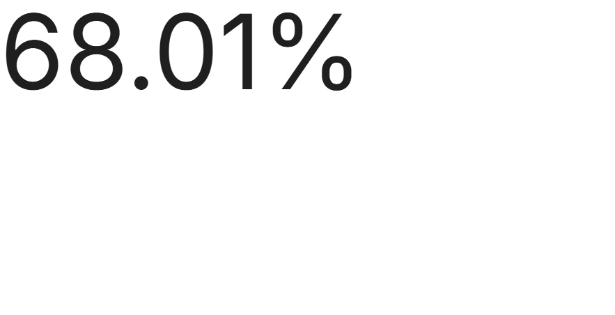
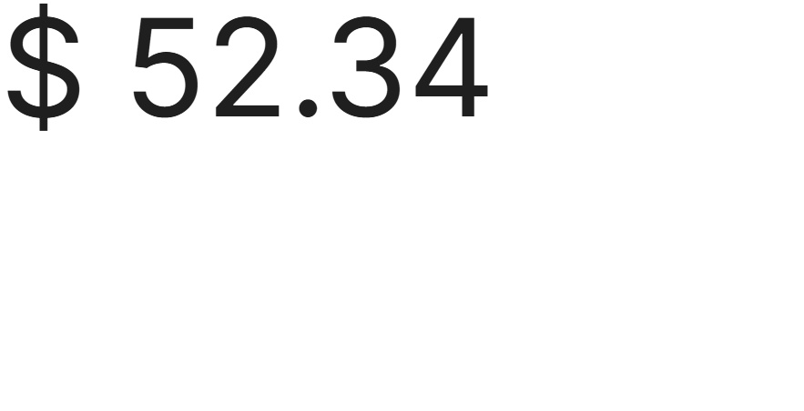

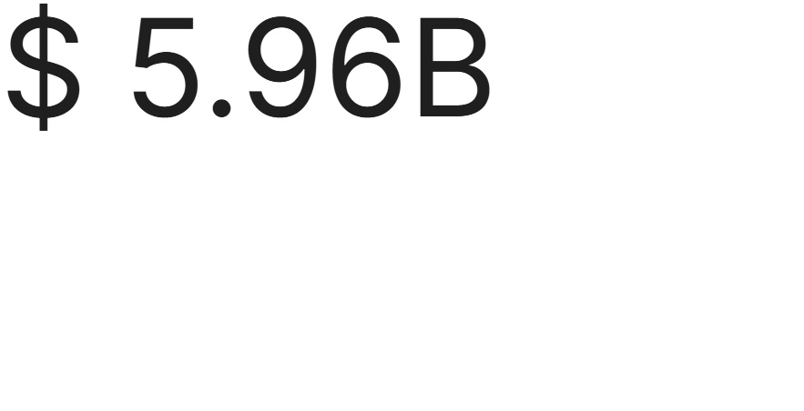
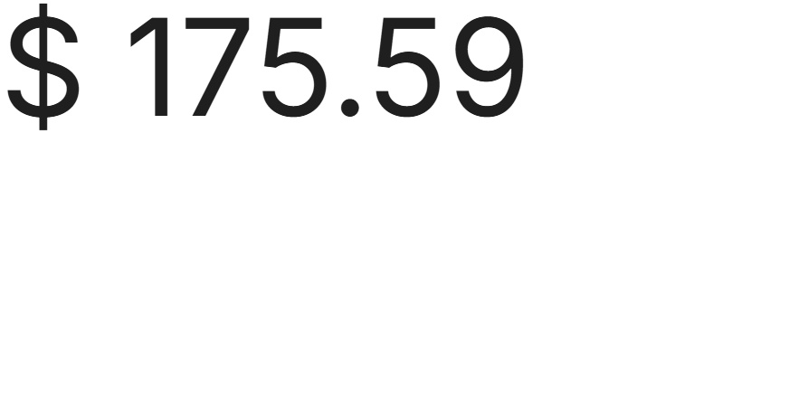
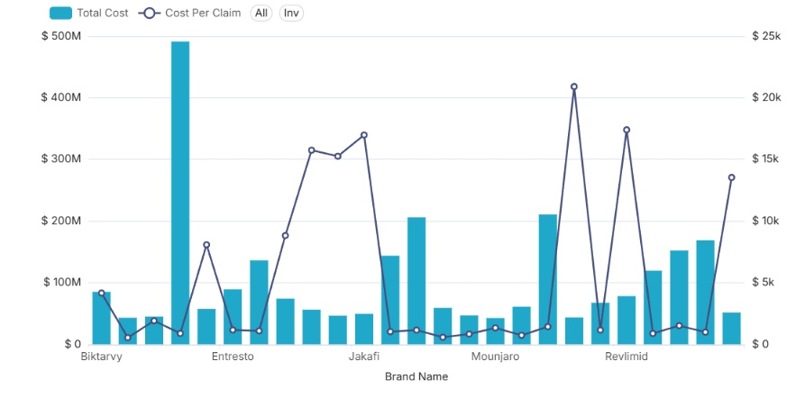
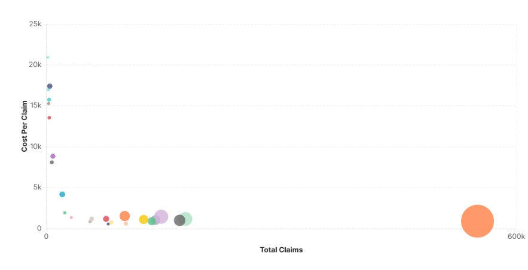
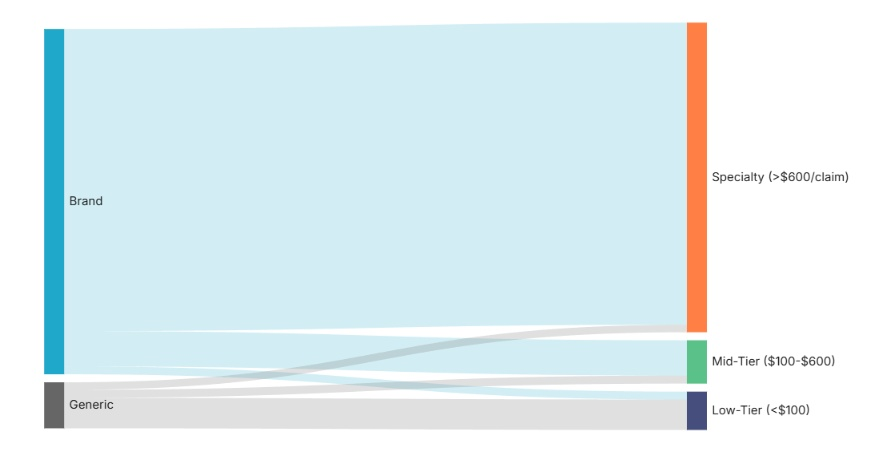
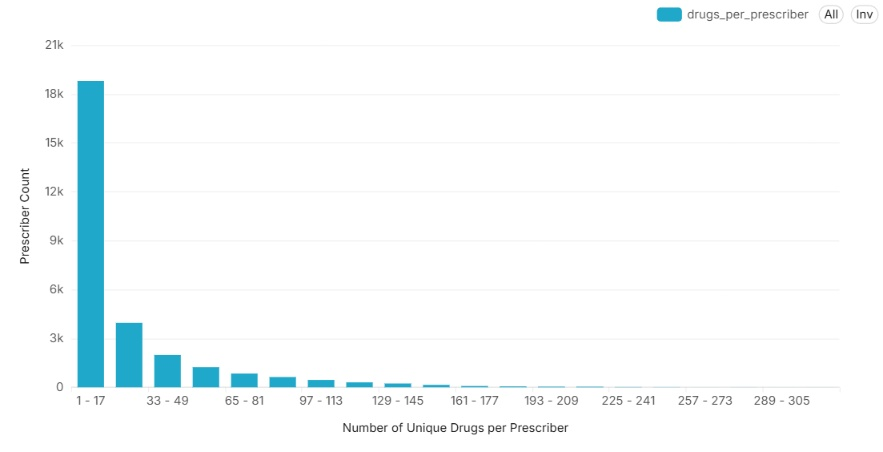
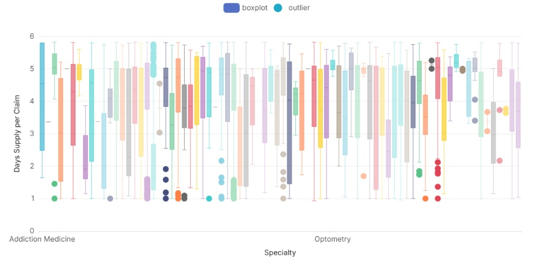
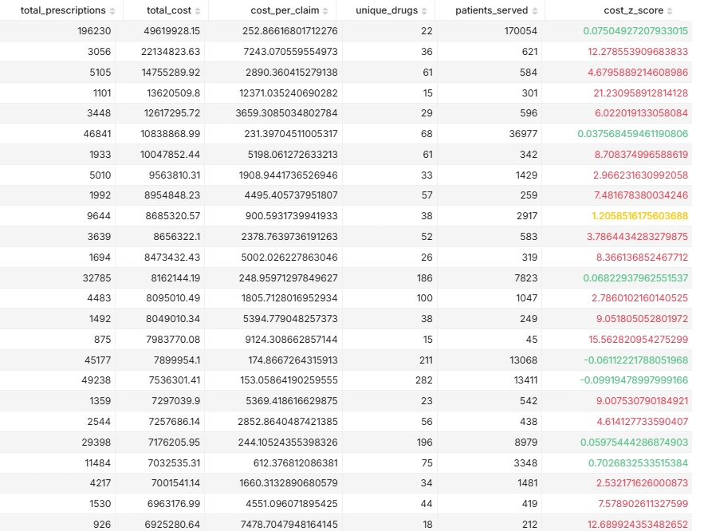
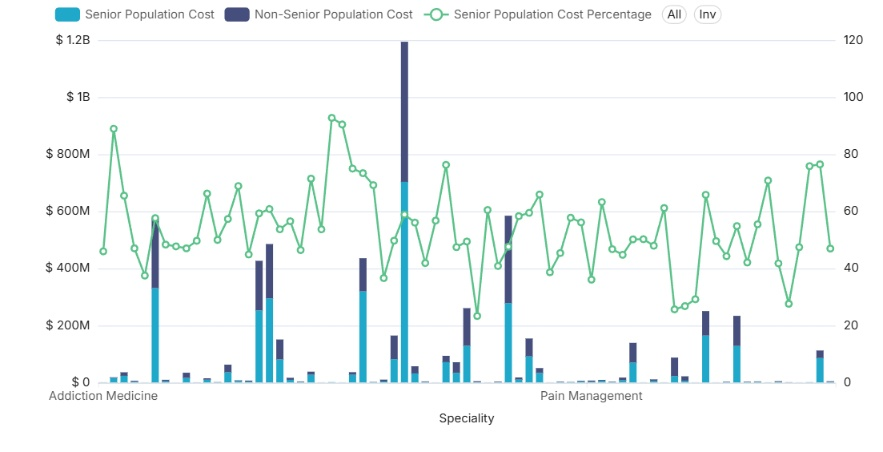
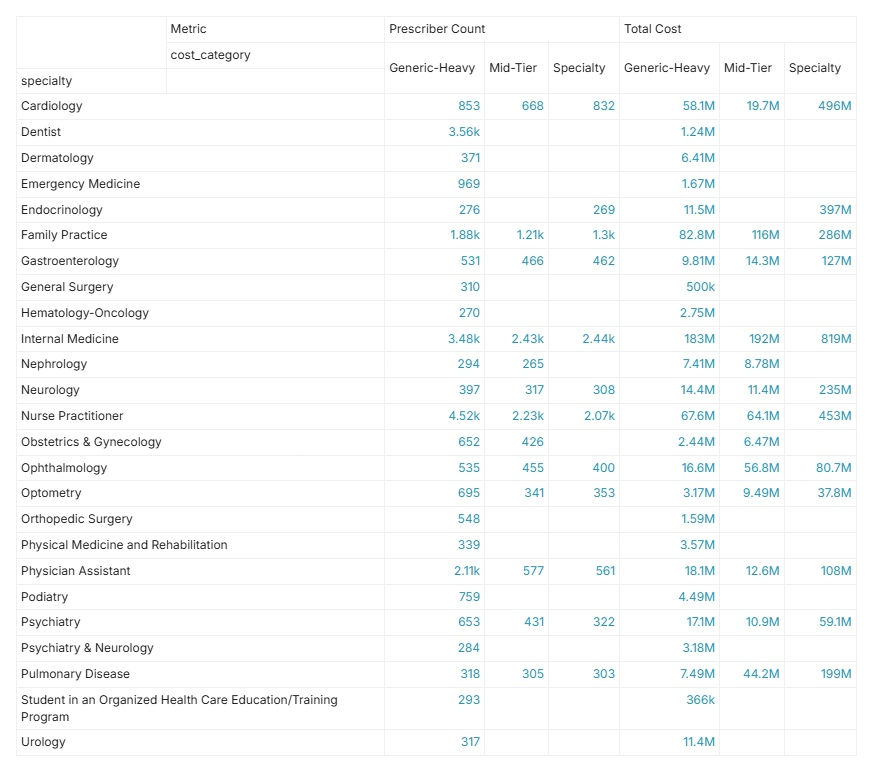

For more details on charts refer : [Charts Guide](analytics/charts_guide.md)

---

## 📚 Key Performance Indicators (KPIs)

| KPI | Formula |
|-----|---------|
| **Cost Per Claim** | Total Cost ÷ Total Claims | 
| **Generic Dispensing Rate** | Generic Scripts ÷ Total Scripts | 
| **PMPM (Cost Per Member)** | Total Cost ÷ Members ÷ 12 | 
| **Medication Adherence** | Avg Days Supply Per Claim | 
| **Specialty Drug %** | Specialty Cost ÷ Total Cost |

---

## 🔐 License & Attribution

**Code & Dashboard:** MIT License  
**Data Source:** Centers for Medicare & Medicaid Services (CMS)  
**Data License:** Public Domain (U.S. Government Work)  
**Dataset:** # Medicare Part D Prescribers - by Provider and Drug (2023)  
**URL:** https://data.cms.gov/provider-summary-by-type-of-service/medicare-part-d-prescribers/medicare-part-d-prescribers-by-provider-and-drug

---

